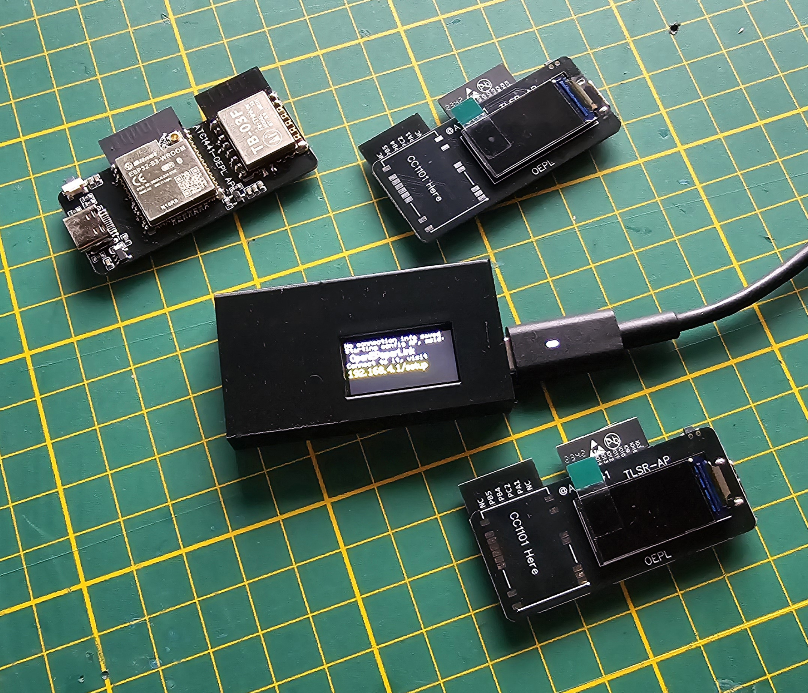
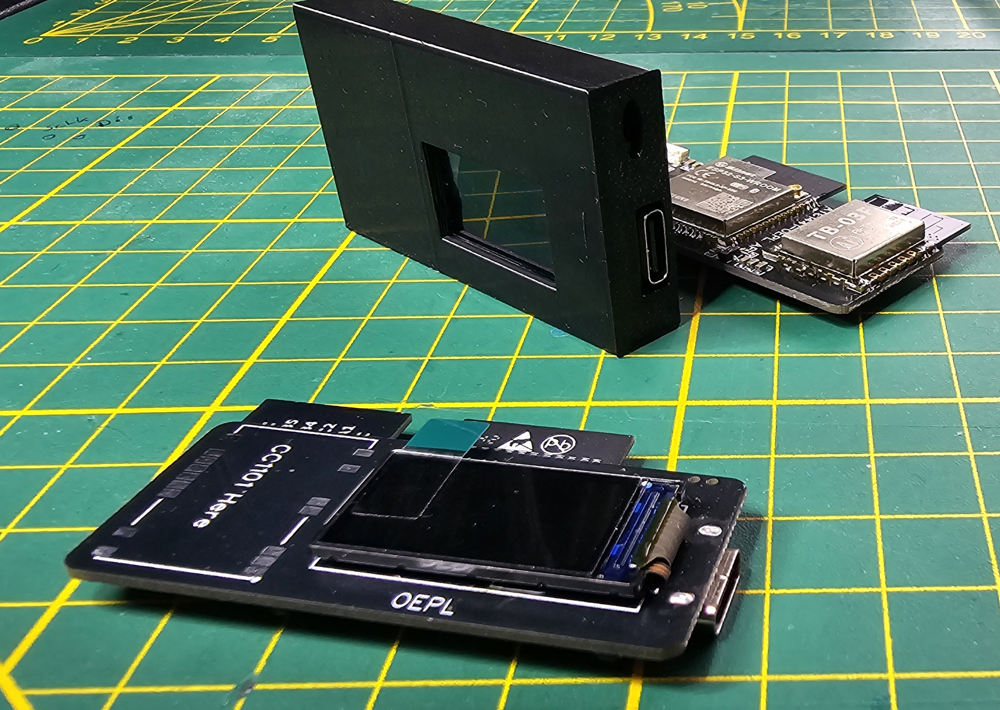

# Simple case for the NanoTLSR AP

## by [ATC1441](https://github.com/atc1441)

Best to print Upright and with 0.2mm layer height. 

The AP will be slid into the side which has some friction to hold the PCB in place.
It is meant to be left open on one site.

Nothing fancy but better than leaving the PCB open.

